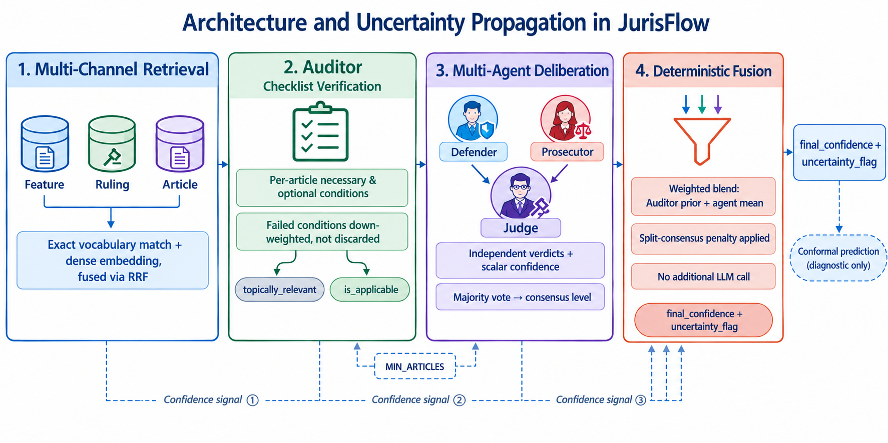

# JurisFlow

**Uncertainty-aware legal RAG for Iranian civil and criminal law.**

JurisFlow is a multi-stage pipeline that retrieves statutory articles, verifies them against per-article checklists, and runs a three-agent deliberation to produce a final answer with a calibrated confidence score. Each stage reports its own confidence signal — so when the system is wrong, you can tell *where* it went wrong.

> 📄 Paper: *Where Does Confidence Get Lost in Graph-Based Legal RAG? A Layer-wise Diagnostic for Persian Civil Law* — submitted to JURIX 2026.



---

## Repository Structure

```
jurisflow/
├── backend/          # Django + Ninja API (search, auditor, agents)
├── pipeline/         # ETL: scrape → parse → embed → load into Neo4j
├── docs/
│   ├── adr/
│   │   ├── backend/  # Architecture Decision Records — backend
│   │   └── pipeline/ # Architecture Decision Records — pipeline
│   └── architecture.png
└── README.md
```

---

## Stack

| Layer | Technology |
|-------|-----------|
| API | Python 3.12 · Django 5 · Django-Ninja |
| Package manager | `uv` |
| Auth | JWT Bearer (`core.auth.jwt_auth`) |
| Relational DB | SQLite (dev) · PostgreSQL (prod) |
| Graph DB | Neo4j AuraDB |
| Embeddings | BGE-M3 via Ollama (local) |
| LLM | Gemini |


---

## How It Works

```
Query
  │
  ▼
Multi-Channel Retrieval    ← feature + ruling + article channels, fused via RRF
  │
  ▼
Auditor                    ← checklist verification per article (Gemini)
  │
  ▼
Multi-Agent Deliberation   ← Defender / Prosecutor / Judge (Gemini)
  │
  ▼
Deterministic Fusion       ← weighted blend, no extra LLM call
  │
  ▼
final_confidence + uncertainty_flag
```

---

## Backend Setup

```bash
cd backend
uv sync
cp .env.example .env   # add NEO4J_URI, NEO4J_PASSWORD, GEMINI_API_KEY
uv run manage.py migrate
uv run manage.py runserver
```

API docs: `http://localhost:8000/api/docs`

| Method | Path | Description |
|--------|------|-------------|
| POST | `/api/search/` | Retrieve relevant articles |
| POST | `/api/auditor/` | Verify articles against checklists |
| POST | `/api/legal-agents/deliberate/` | Run full deliberation |

---

## Pipeline Setup

```bash
cd pipeline
uv sync
cp .env.example .env   # add NEO4J_URI, NEO4J_PASSWORD
```

Run in order — each step is resumable:

```bash
uv run main_laws.py load      # load statutory articles
uv run main_cases.py load     # load court rulings
uv run main_features.py load  # extract features
uv run embed_all.py           # embed articles and rulings
uv run embed_features.py      # embed features
```

---

## Calibration Results

| Layer | AUROC | ECE | Accuracy |
|-------|-------|-----|----------|
| Retrieval | 0.756 | — | — |
| Auditor | 0.920 | 0.119 | 85.7% |
| Agent deliberation (gold input) | — | 0.172 | 100% |
| End-to-end | 0.395 | 0.247 | 53.6% |

The end-to-end gap is explained by Auditor topical-relevance recall (50% gold retention), not agent reasoning — see the paper for full error analysis.

---

## Architecture Decisions

**Backend:** [ADR-001 Retrieval](docs/adr/backend/ADR-001-Retrieval.md) · [ADR-002 Auditor Design](docs/adr/backend/ADR-002-Auditor-Design.md) · [ADR-003 Multi-Agent Debate](docs/adr/backend/ADR-003-Multi-Agent-Debate.md) · [ADR-004 Deterministic Fusion](docs/adr/backend/ADR-004-Deterministic-Fusion.md)

**Pipeline:** [ADR-001 Neo4j](docs/adr/pipeline/ADR-001-Why-Neo4j.md) · [ADR-002 ETL Articles & Rulings](docs/adr/pipeline/ADR-002-Data-Pipeline-Articles-and-Rulings(ETL).md) · [ADR-003 Features](docs/adr/pipeline/ADR-003-Data-Pipeline(ETL)-Features.md) · [ADR-004 Embedding](docs/adr/pipeline/ADR-004-Data-Pipeline-Embedding(ETL).md)

---

## Dataset

- 3,891 statutory articles (5 Iranian codes)
- 2,398 court rulings
- 112 training · 28 test · 25 conformal-calibration instances